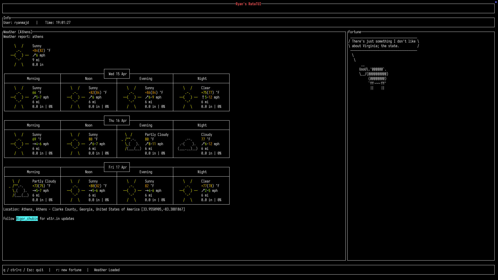
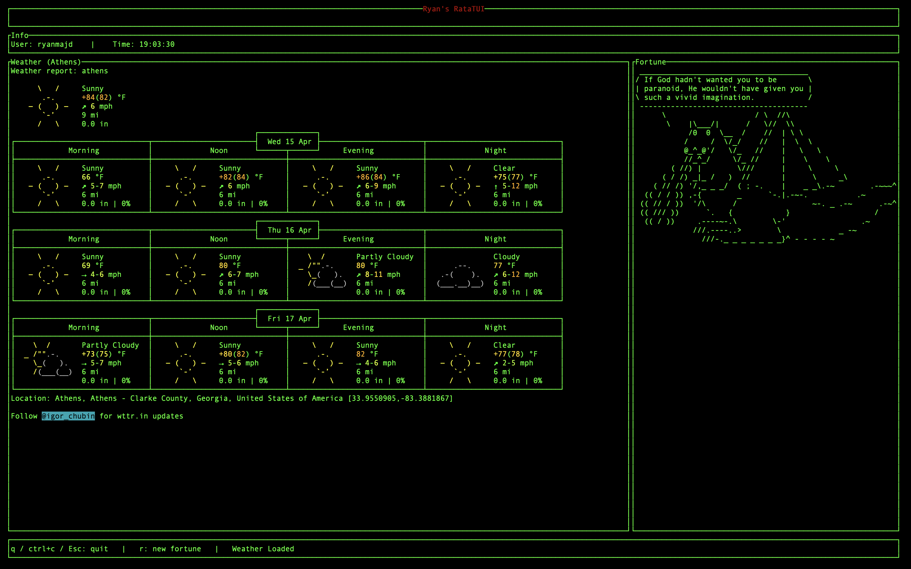

[](https://ratatui.rs/)

# Rust TUI Splashscreen

A simple terminal splash screen built with **Rust** and **Ratatui**.

I made this with `2 hours and 50 minutes` of Rust experience!

It displays:

- your username
- the current time
- the weather from `wttr.in`
- a random fortune piped into `cowsay`

The goal of this project was to learn Rust by building a small but real terminal user interface instead of just a basic hello world.
Preserves default color choices

## Preview




Make sure you have the following installed:

- Rust + Cargo
- `curl`
- `fortune`
- `cowsay`

### Install dependencies (macOS)

```bash
brew install curl fortune cowsay
```

## Running it

From the project directory:

```bash
cargo run
```
